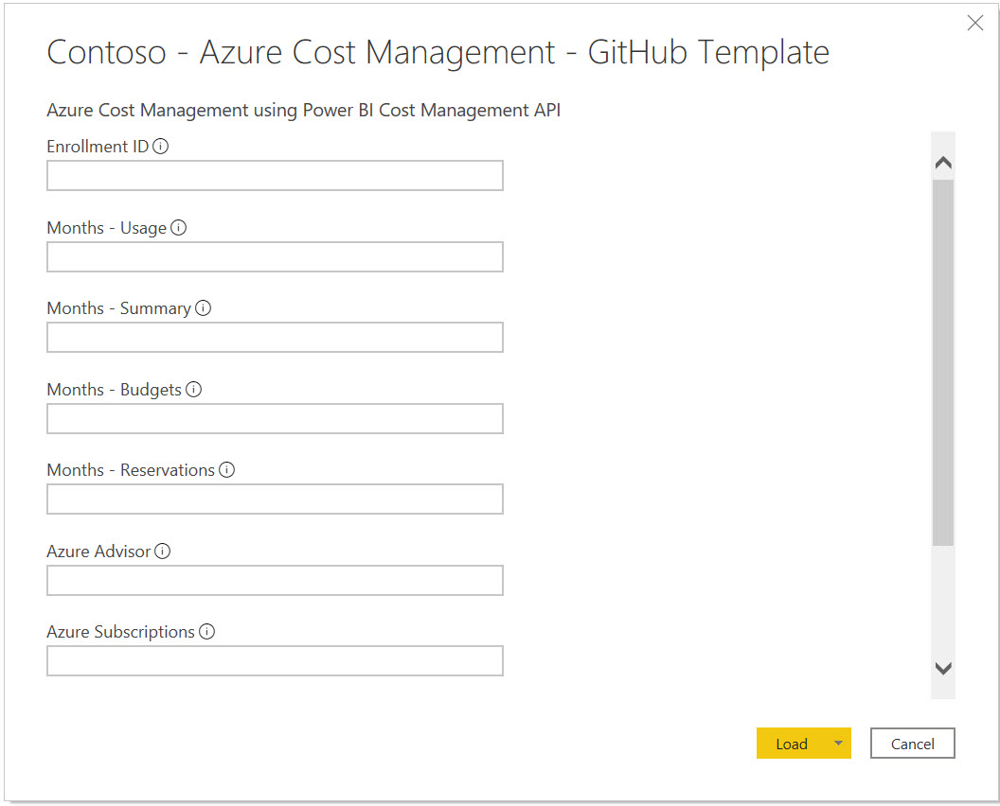
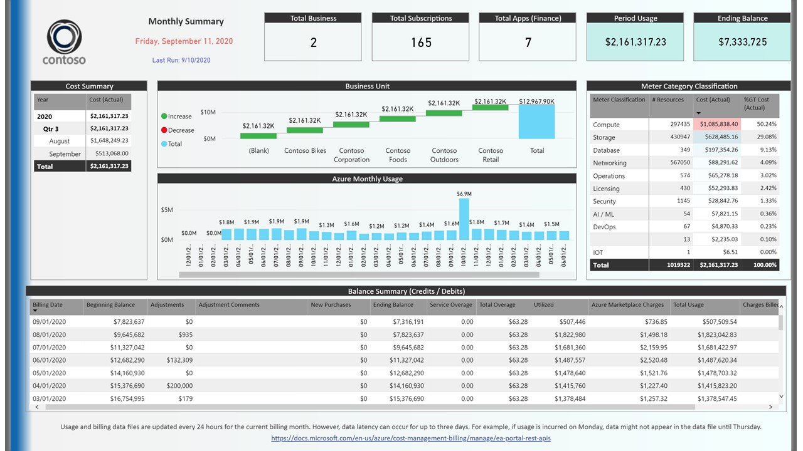
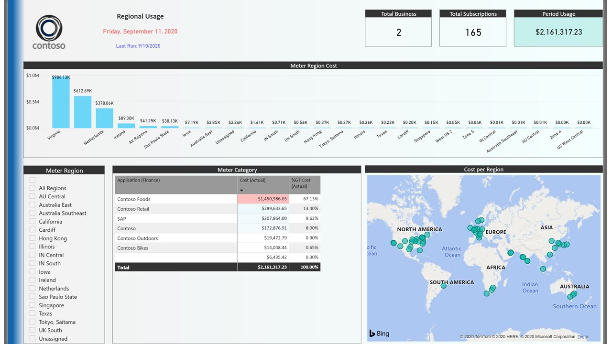

# Cost Management Dashboard
This cost management dashboard is an addon to the Azure Cost Management API, you will be able to drill into your Azure costs and analyze them based on your tags.

# Disclaimer
THE SCRIPTS ARE PROVIDED AS IS WITHOUT WARRANTY OF ANY KIND, EITHER EXPRESS OR IMPLIED, INCLUDING ANY IMPLIED WARRANTIES OF FITNESS FOR A PARTICULAR PURPOSE, MERCHANTABILITY, OR NON-INFRINGEMENT.

# Getting Started
## Requirements
To use the cost management dashboard you are required to have following information
* run Excel and PowerBI on your PC
* Azure Cost Management API PowerBI key
* access to your Azure Subscription incl permissions for Cost Management API

## How to deploy the Cost Management Dashboard
1. Download all files from this site
2. Update the metadata files (Excel Files)
3. Start the PowerBI Template
4. Enter the required data (PowerBI parameters)
5. Refresh data to perform a first test
6. Update the PowerBI Theme
7. Publish your Report if you want to make it accessible to others

## Starting PowerBI for the first time
When opening the template for the first time you will get a screen to fill out your connection details:

* Enrollment ID: can be found on your EA Portal
* Months - Usage: number of month to download, we recommend to start with 2
* Months - Summary: number of month to download, we recommend to start with 12
* Months - Budgets: number of month to download, we recommend to start with 12
* Months - Reservations: number of month to download, we recommend to start with 36
* Azure Advisor: local path to CSV file downloaded from Azure Advisor
* Azure Subscriptions: local path to Excel file about Azure Subscriptions
* Subscription Metadata: local path to Excel file with Subscription Metadata
* Price Sheet Validation: local path to your Microsoft pricesheet

## Using metadata files to map costs
The PowerBI Dashboard used Azure tags to combine different types of costs.
So it is easy to see what the total costs of e.g. a VM which is combined out of Compute, Storage, Networking, Backup and other meters.
Sometimes tags change over time or you e.g. had a typo in the tags. Thats where the metadata files can help as you can map old data to new data.
As an example you might change the cost center structure for all of your Azure resources, but what about the old data? The tags and associated costs won't change for historic data.
Mapping those old tags to the new once still provides the same view on applications or resources, even if they are tagged differently.

The basic dataflow is explain in the following diagram

## Find more information

### Azure Cost Management API
You can find more information about the Azure Cost Management API on
[https://docs.microsoft.com/en-us/power-bi/connect-data/desktop-connect-azure-cost-management](https://docs.microsoft.com/en-us/power-bi/connect-data/desktop-connect-azure-cost-management)

The Azure Cost Management connector uses OAuth 2.0 for authentication with Azure and identifies users who are going to use the connector. Tokens generated in this process are valid for a specific period. Power BI preserves the token for the next login. OAuth 2.0, is a standard for the process that goes on behind the scenes to ensure the secure handling of these permissions.

### Azure Cost Consumption API v2
[https://docs.microsoft.com/en-us/rest/api/consumption/](https://docs.microsoft.com/en-us/rest/api/consumption/)

### Get Enterprise Agreement Reservation Costs and Usage
[https://docs.microsoft.com/en-us/azure/cost-management-billing/reservations/understand-reserved-instance-usage-ea](https://docs.microsoft.com/en-us/azure/cost-management-billing/reservations/understand-reserved-instance-usage-ea)

### Cost Management Connector v2
[https://docs.microsoft.com/en-us/power-bi/connect-data/desktop-connect-azure-cost-management](https://docs.microsoft.com/en-us/power-bi/connect-data/desktop-connect-azure-cost-management)

# Questions
if you have questions please open an issue on the GitHub site

# Sample Screenshots

Home Screen

Summary page

Applications view

Meter details

Networking

Cost Center

Reserverations

Regions

Price Sheet

## Contributing

This project welcomes contributions and suggestions. Most contributions require you to agree to a
Contributor License Agreement (CLA) declaring that you have the right to, and actually do, grant us
the rights to use your contribution. For details, visit https://cla.opensource.microsoft.com.

When you submit a pull request, a CLA bot will automatically determine whether you need to provide
a CLA and decorate the PR appropriately (e.g., status check, comment). Simply follow the instructions
provided by the bot. You will only need to do this once across all repos using our CLA.

This project has adopted the [Microsoft Open Source Code of Conduct](https://opensource.microsoft.com/codeofconduct/).
For more information see the [Code of Conduct FAQ](https://opensource.microsoft.com/codeofconduct/faq/) or
contact [opencode@microsoft.com](mailto:opencode@microsoft.com) with any additional questions or comments.